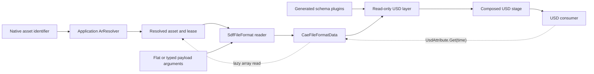

<!-- SPDX-FileCopyrightText: Copyright (c) 2026 NVIDIA CORPORATION & AFFILIATES. All rights reserved. -->
<!-- SPDX-License-Identifier: Apache-2.0 -->

# Repository Architecture

> **Status:** Implemented
>
> **Audience:** Users, application integrators, and developers

CAE OpenUSD Plugins connects native scientific-data formats to OpenUSD through
two extension points:

- **Schema plugins** define a format-independent scientific-data vocabulary
  and domain-specific semantics.
- **File-format plugins** present supported native assets as read-only USD
  layers.

The USD layer is the boundary between them. Readers author prims and metadata,
apply the appropriate schemas, and expose arrays as typed USD attributes.
Consumers use ordinary USD traversal, composition, and value resolution rather
than reader-specific APIs.

## System Data Flow



Opening an asset resolves it, discovers its hierarchy and array metadata, and
registers lazy value loaders. Traversal and metadata inspection do not
materialize the large arrays. An explicit attribute value request invokes the
corresponding loader; the layer's cache policy determines whether that value is
retained.

## Schema Plugins

Schema sources live under `source/schemas/`. Each library is registered in
`source/schemas/CMakeLists.txt`; CMake runs `usdGenSchema`, builds the generated
plugin, installs its headers and resources, and optionally builds its Python
bindings.

The schema libraries have three roles:

- `omniSci` supplies the shared dataset, field, and array vocabulary.
- Domain libraries add semantics such as CGNS zones, OpenFOAM polyhedral
  meshes, VTK dataset kinds, and reservoir index spaces.
- `omniSciFileFormatArgs` supplies typed attributes that configure dynamic
  file-format payloads.

Domain APIs compose with the core APIs instead of creating a deep inheritance
tree. A reader remains responsible for mapping its source concepts to these
schemas; the schemas do not parse or own native data.

See [Core OmniSci schemas](schemas/omni_sci.md), the
[schema library index](schemas/README.md), and the
[Conceptual Data Mappings](conceptual_data_mapping/README.md).

## File-Format Plugins

File-format implementations live under `source/file_formats/`. Each format
directory registers one or more `SdfFileFormat` implementations in
`plugInfo.json` with the normal `usd` target and `primary = false`. OpenUSD
therefore selects a reader by the native file extension while preserving its
normal USD composition behavior.

Readers are read-only: they translate a native source into an in-memory USD
layer but do not claim to round-trip edits back to the source format.

Most readers use the shared `CaeFileFormatData` backend, which combines
ordinary `SdfData` structure with deferred, time-sampled array loaders.
Native readers implement parsing and value loading in C++; Python-backed
readers use `PythonFileFormatBase` and return a manifest describing their lazy
attributes. Both paths expose the same USD-facing layer behavior.

Reader-specific root placement, array naming, caching, and Python callback
contracts are documented in
[File-format architecture](file_formats/architecture.md).

## Asset Resolution

File-format plugins ask the application's active `ArResolver` to resolve and
open asset identifiers. They do not embed clients for particular storage
schemes.

The shared resolver boundary preserves three distinct values:

- the original identifier used by USD composition and relative child assets;
- the opaque resolved path supplied by the resolver;
- a lease-scoped local path for third-party libraries that require filenames.

The local path may be the original file, a resolver-managed cache entry, or a
temporary materialization. Lazy loaders retain the asset lease for as long as
they may need that path.

Readers can resolve explicitly named child assets relative to their root.
OpenUSD's resolver API cannot portably enumerate directories, so formats that
depend on directory scanning require a local filesystem unless they provide an
explicit manifest. The per-format support matrix is in
[Conceptual Data Mappings](conceptual_data_mapping/README.md#asset-resolution-and-dataset-layout).
See [Asset resolution](file_formats/asset_resolution.md) for local materialization,
lease lifetime, child-asset behavior, and diagnostics.

## File-Format Arguments and Recomposition

Direct opens and sublayers pass string-valued arguments in an
`Sdf.Layer` identifier. Payloads can instead apply format-specific attributes
from `omniSciFileFormatArgs` to the payload-bearing prim. OpenUSD derives the
backing layer's arguments through `PcpDynamicFileFormatInterface`.

Changing one of those composed attributes invalidates the affected dynamic
layer and recomposes the payload. The reader discovers the structure again
using the new arguments; callers do not remove, re-add, or explicitly reload
the payload.

See [File-format arguments](file_formats/arguments.md) for the supported
arguments and typed APIs.

## Runtime Registration

An install contains a top-level `plugin/usd/plugInfo.json` that includes the
resources of every enabled plugin. A compatible OpenUSD application can
discover that tree through `PXR_PLUGINPATH_NAME`.

Python applications can instead register it explicitly:

```python
import cae_openusd_plugins

cae_openusd_plugins.register_usd_plugins()
```

Importing `cae_openusd_plugins` alone has no registration side effect. The
helper validates the active OpenUSD version, registers the plugin tree, extends
the active `pxr` package path with generated schema modules, and updates
`PXR_PLUGINPATH_NAME` for child processes.

## Build and Package Boundary

The top-level project is a normal CMake consumer of OpenUSD and the
dependencies required by enabled readers. `cmake/superbuild/` is an optional
convenience layer that builds pinned dependency SDKs and generates initial
cache files for the main project; the main project does not require it.

One set of install rules produces:

- a CMake install tree;
- a CPack archive; or
- the private native runtime embedded in a Python wheel.

OpenUSD is not bundled. Native plugins must run with the OpenUSD version and
ABI they were built against. Direct shared dependencies may be bundled into
archives when explicitly configured; statically linked dependencies are
already part of the plugin libraries.

See [Build](build.md) and [Installation and packaging](installation.md).

## Repository Map

| Path | Responsibility |
| --- | --- |
| `source/schemas/` | Schema sources, generated plugins, and optional Python bindings |
| `source/file_formats/` | Native and Python-backed readers plus their shared runtime |
| `python/cae_openusd_plugins/` | Runtime validation and explicit plugin registration |
| `cmake/` | OpenUSD discovery, plugin helpers, CI drivers, packaging, and the optional superbuild |
| `tests/` | Schema, reader, integration, packaging, and installed-tree tests |
| `docs/conceptual_data_mapping/` | Public source-format-to-USD semantic contracts |
| `docs/development/` | Plugin development guides and maintainer architecture |
| `docs/file_formats/` | Shared reader behavior and user-facing composition workflows |
